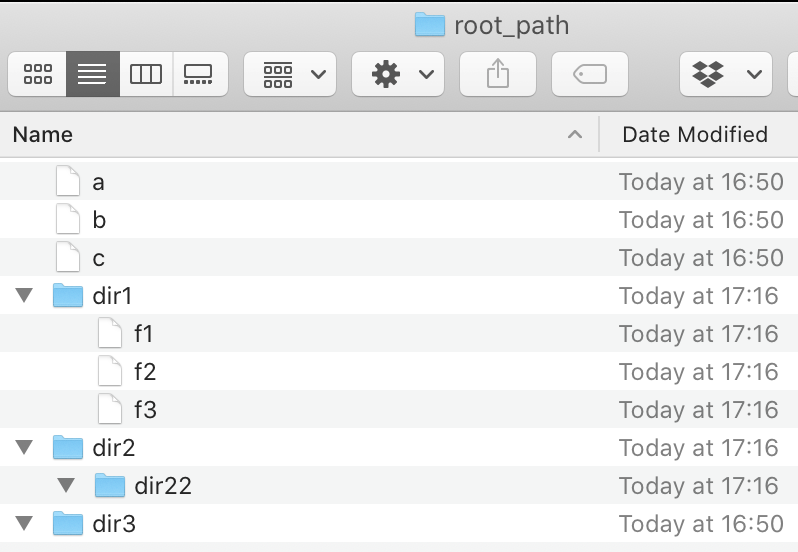

# Yulco Home Assignment
Thank you for applying to work with us, attached is your home assignment.
## Work Outline
* Your personal time is important to us, so please dedicate up to 3 hours working on it.
* When you're finished please send us a Zip archive or a link to a public git repo containing your code and running instructions.
*  If you have any questions, make a decision you're comfortable with and document it, we can talk about it later on.
*  The technology stack choices are up to you, as long as it's readable and the result artifact is runnable on a Linux/Mac machine.

## Requirements
Your goal is to write IFS - Insecure File System. It’s a REST API for performing operations on your file system.
* The service will accept requests on port 5000.
* The following endpoints should be exposed:
    * `GET /fs/<path>` : Return a JSON response structured as:
        ```
        {"success": true, 
         "fs": {"filename": "<path from request>", 
                "dirs": ["dir1", "dir2", "dir3"], 
                "files": ["a", "b", "c"]}}
        ```
        
    * `DELETE /fs/<path>` : Delete the file or directory at `<path>`.
    * `PUT /fs/<path>` with body `{name: "<new path>"}` : Move the file at `<path>` to `<new path>`.
* Any errors should return the following response with an appropriate error message:
    ```
    {"success": false, "error": "...."}
    ```
* The service will be initialized with a given root path on the system.
    * All paths given would be relative to base root path. For example: Given root path for the system `/tmp/ifs/`, a request for `GET /fs/a/b/c` should return the listing for `/tmp/ifs/a/b/c` on your machine.
    * The given root path should not be part of the requests or responses of the system, and should not be exposed externally.
    * If the root path is invalid, the service should not run.
